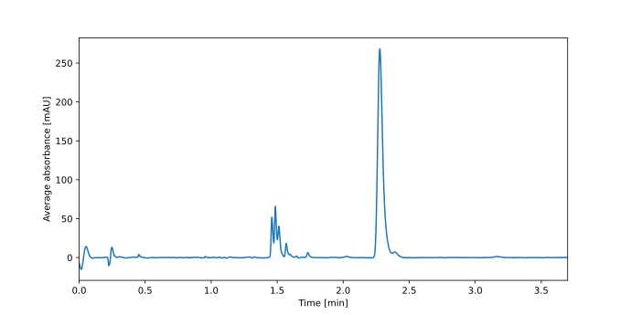
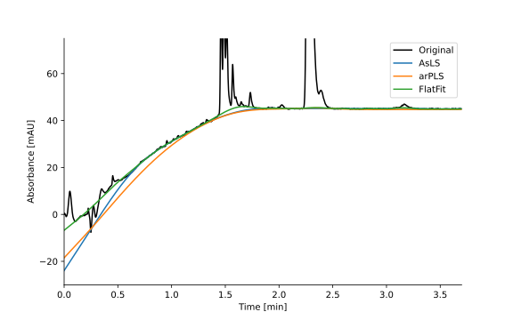

Baseline Correction
===================

Baseline correction is often overlooked, but it is crucial for accurate peak modelling and integration.

First let's import MOCCA2.

.. code-block:: python

    from mocca2 import example_data, estimate_baseline
    from matplotlib import pyplot as plt

The best way to correct baseline is using blank, and then by refining the baseline.

.. code-block:: python

    # Load example chromatogram
    chromatogram = example_data.example_1(substract_blank=True)

    # Refine the baseline
    chromatogram.correct_baseline()

    # Load the chromatogram without baseline correction and without blank subtraction
    chromatogram_no_baseline = example_data.example_1(substract_blank=True)
    chromatogram_no_blank = example_data.example_1(substract_blank=False)

    # Plot the chromatogram with corrected baseline
    fig, ax = plt.subplots(figsize=(8, 5))
    chromatogram_no_blank.plot(ax, color="green", label="No blank subtraction")
    chromatogram_no_baseline.plot(ax, color="red", label="No baseline correction")
    chromatogram.plot(ax, label="Corrected")

    plt.legend()
    # plt.savefig("docs/_static/ex_baseline_corrected.svg")
    plt.show()

We can also take a look onto different algorightms for baseline estimation.
Let's pretend we don't have the blank run, so that we can compare it to the estimated baseline.

.. code-block:: python

    # Load example chromatogram
    chromatogram = example_data.example_1(substract_blank=False)

    # To make things faster, lets average absorbance over all wavelengths
    mean_absorbance = chromatogram.contract()

    # Estimate baseline using different methods
    baseline_asls = estimate_baseline(mean_absorbance, method="asls")
    baseline_arpls = estimate_baseline(mean_absorbance, method="arpls")
    baseline_flatfit = estimate_baseline(mean_absorbance, method="flatfit")

    # Plot the result
    fig, ax = plt.subplots(figsize=(8, 5))

    chromatogram.plot(ax, label="Original")
    ax.plot(chromatogram.time, baseline_arpls, label="AsLS")
    ax.plot(chromatogram.time, baseline_asls, label="arPLS")
    ax.plot(chromatogram.time, baseline_flatfit, label="FlatFit")

    ax.set_ylim(-30, 75)
    plt.legend()
    # plt.savefig("docs/_static/ex_baseline_comparison.svg")
    plt.show()

A few remarks:
 * The blank has slightly lower intensity than the sample baseline - for this reason it is better to refine baseline even if blank is substracted
 * AsLS significanly underestimates baseline in the 0.5 - 1.5 minute region
 * It is hard to interpret the 0 - 0.5 min region where are positive and negative peaks caused by the solvents. These obviously cannot be corrected by any general baseline correction algorithm
 * The region under the peak around 1.4 - 1.8 minutes shows how different methods approach baseline under peaks differently. The FlatFit seems to best capture the bend in the baseline.

For not-very-noisy data, I would recommend using FlatFit. It is very fast and stable algorithm which can also handle negative peaks.

The description of individual methods is in the :ref:`baseline <ref_baseline>` reference.