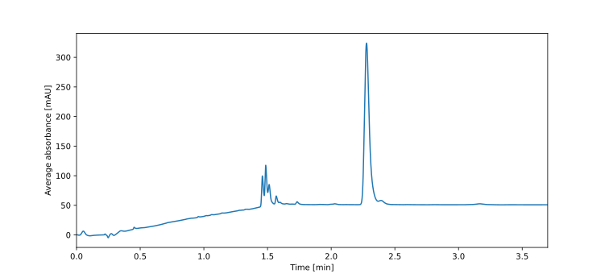
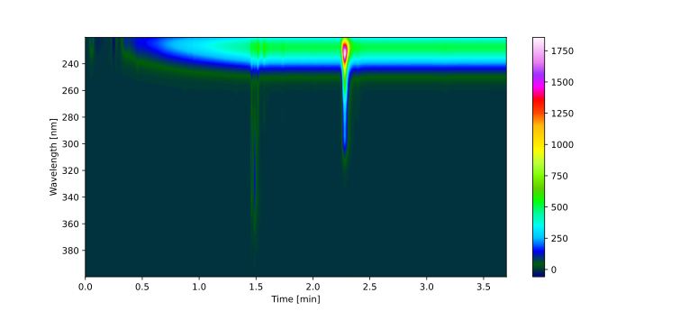
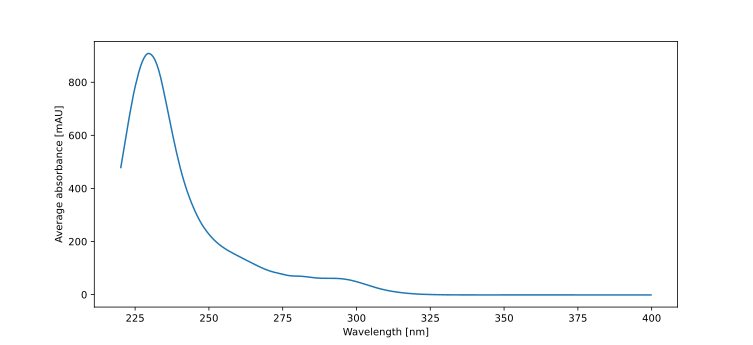

Basic Data Manipulation
=======================

This examples demonstrates how to load and manipulate chromatogram data using the :class:`Data2D<mocca2.classes.data2d.Data2D>` and :class:`Chromatogram<mocca2.Chromatogram>` classes.

First, let's import some packages:

.. code-block:: python

    from mocca2 import Chromatogram, example_data
    import numpy as np
    from matplotlib import pyplot as plt

The data can be loaded simply using the :class:`Chromatogram<mocca2.Chromatogram>` constructor.

.. code-block:: python

    PATH_TO_SAMPLE_CHROMATOGRAM = "src/mocca2/example_data/data/examples/chrom1.arw"
    PATH_TO_BLANK_CHROMATOGRAM = "src/mocca2/example_data/data/examples/blank1.arw"

    # Load raw data from file
    # Including the blank is optional, but makes the processing easier
    chromatogram = Chromatogram(
        sample=PATH_TO_SAMPLE_CHROMATOGRAM,
        blank=PATH_TO_BLANK_CHROMATOGRAM,
    )

    # Alternatively, you can use example data
    chromatogram = example_data.example_1()

The :class:`Data2D<mocca2.classes.data2d.Data2D>` class provides basic functions for cropping, averaging, etc. Let's crop data to wavelengths between 220 - 400 nm.

.. code-block:: python

    # Crop wavelength between 220 and 400 nm
    chromatogram.extract_wavelength(220, 400, inplace=True)

The :class:`Data2D<mocca2.classes.data2d.Data2D>` makes the plotting of chromatograms very easy:

.. code-block:: python

    # Plot chromatogram (averaged over wavelenghts)
    fig, ax = plt.subplots(figsize=(8, 5))
    chromatogram.plot(ax)
    plt.show()

.. code-block:: python

    # Plot 2D chromatogram as heatmap
    fig, ax = plt.subplots(figsize=(8, 5))
    chromatogram.plot_2d(ax)
    plt.show()

Let's take a closer look on the peak around 2.3 minutes. First, we extract the relevant region.

.. code-block:: python

    # Extract raegion with peak
    peak_region = chromatogram.extract_time(2.2, 2.35)

Now, we could for example average the absorption spectrum over the peak.

.. code-block:: python

    # Average spectrum
    # The chromatogram data are just numpy arrays, axes are [wavelength, time]
    avg_spectrum = np.mean(peak_region.data, axis=1)
    plt.subplots(figsize=(8, 5))
    plt.plot(peak_region.wavelength, avg_spectrum)
    plt.xlabel("Wavelength [nm]")
    plt.ylabel("Average absorbance [mAU]")
    # plt.savefig("docs/_static/ex_basic_spectrum.svg")
    plt.show()

For futher details see the reference for :class:`Data2D<mocca2.classes.data2d.Data2D>` and :class:`Chromatogram<mocca2.Chromatogram>`.