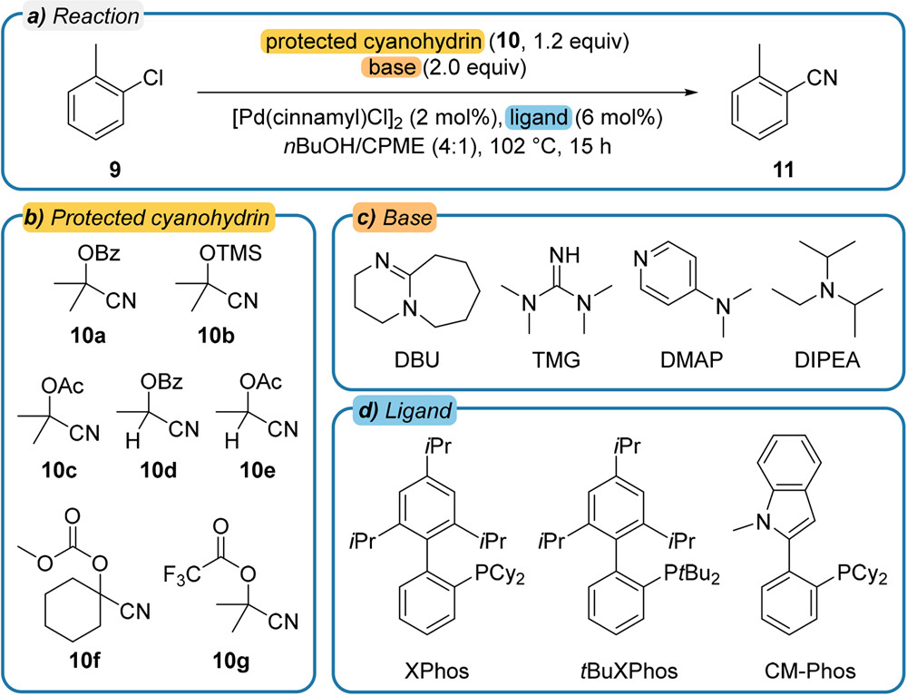
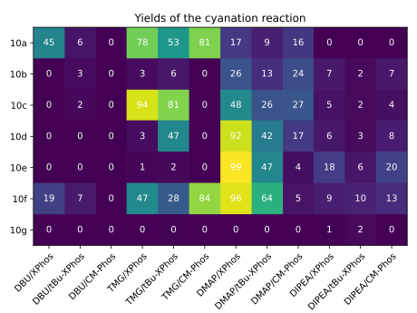

Batch Processing
================

What makes MOCCA2 very powerful is the ability to process many chromatograms at once.

In this tutorial, we will process the dataset from condition screening from a Pd-catalyzed cyanation reaction, published by `Haas et al., 2023 <https://doi.org/10.1021/acscentsci.2c01042>`_.

This dataset contains 84 chromatograms, standards of the starting material and the product, and all chromatograms use tetralin as the internal standard.

Creating the MOCCA2 dataset
---------------------------

First, let's import the necessary packages and load the chromatograms.

.. code-block:: python

    from mocca2 import example_data, MoccaDataset, ProcessingSettings
    from matplotlib import pyplot as plt
    import numpy as np

    # Load example data
    chromatograms = example_data.cyanation()

Now we can instantiate the :class:`MoccaDataset<mocca2.MoccaDataset>` and add the chromatograms.

When adding the chromatograms, it is possible to specify additional data, such as information about standards and internal standards.

.. code-block:: python

    # Create the MOCCA2 dataset
    dataset = MoccaDataset()

    # Specify chromatogram with with internal standard
    tetralin_concentration = 0.06094
    dataset.add_chromatogram(
        chromatograms["istd"],
        reference_for_compound="tetralin",
        istd_reference=True,
        compound_concentration=tetralin_concentration,
        istd_concentration=tetralin_concentration,
    )

    # Add standards for starting material and product
    dataset.add_chromatogram(
        chromatograms["educt_1"],
        reference_for_compound="starting_material",
        compound_concentration=0.0603,
        istd_concentration=tetralin_concentration,
    )
    dataset.add_chromatogram(
        chromatograms["product_1"],
        reference_for_compound="product",
        compound_concentration=0.05955,
        istd_concentration=tetralin_concentration,
    )

    # Add the chromatograms for the reactions
    for chromatogram in chromatograms["reactions"]:
        dataset.add_chromatogram(chromatogram, istd_concentration=tetralin_concentration)

Processing the chromatograms
----------------------------

To process the chromatograms, we need to define the processing settings. Most of the default values are usually fine, but it is advisable to always check the chromatograms and adjust the settings if necessary.

.. code-block:: python

    # Specify the processing settings
    # Default values are usually fine, but check the results and adjust if necessary
    settings = ProcessingSettings(
        baseline_model="arpls",
        min_elution_time=2.5,
        max_elution_time=5,
        min_wavelength=230,
        # Some of the chromatograms contain very intense peaks, most likely decomposed reagents
        # To detect the smaller peaks of interest, disable filtering by relative height
        min_rel_prominence=0.0,
        min_prominence=1,
        # Increase the required peak purity
        explained_threshold=0.998,
    )

Processing the dataset is a one-liner. It is possible to parallelize the processing over multiple cores.

.. code-block:: python

    # Process the dataset
    dataset.process_all(settings, verbose=True, cores=15)

Running this command can take around 5 minutes.

.. code-block::

    Cropping wavelengths
    Correcting baseline
    Picking peaks
    Deconvolution
    Clustering compounds
    Refining peaks
    Naming compounds
    Compound starting_material has conc factor vs ISTD 1.766
    Compound product has conc factor vs ISTD 0.100
    Processing finished!

Parsing the results
-------------------

The :class:`MoccaDataset<mocca2.MoccaDataset>` has some handy methods to get the processed data.

In our case, we want to get the concentrations of the starting material and the product relative to the internal standard, and calculate conversion and yield.

.. code-block:: python

    # Get concentrations relative to the internal standard
    results = dataset.get_relative_concentrations()[0][
        ["Chromatogram", "starting_material", "product"]
    ]

    # If a compound is not detected, the concentration is set to nan
    # Convert nan to 0
    results = results.fillna(0)

    # Calculate conversion and yield
    initial_concentration = 0.06
    results["Conversion [%]"] = (
        100 * (initial_concentration - results["starting_material"]) / initial_concentration
    )
    results["Yield [%]"] = 100 * results["product"] / initial_concentration

    # Print the results
    print(
        results[["Chromatogram", "Conversion [%]", "Yield [%]"]]
        .round(0)
        .to_string(index=False)
    )

This prints the yields and conversions of all reactions.

.. code-block::
    
    Chromatogram  Conversion [%]  Yield [%]
            istd            85.0        0.0
         educt_1            -1.0        0.0
       product_1           100.0       99.0
      reaction_1            47.0       41.0
      reaction_2           -12.0        5.0
      reaction_3           100.0        0.0
      reaction_4           100.0       68.0
      reaction_5           100.0       49.0
    [...]
     reaction_79            14.0        0.0
     reaction_80            -1.0        0.0
     reaction_81             4.0        0.0
     reaction_82            26.0        1.0
     reaction_83            10.0        2.0
     reaction_84             5.0        0.0

Visualizing the yields
----------------------

With 96-well formats, it might be convenient to visualize the results in a heatmap.

In this case, the reactions were run in a 96-well plate, with one of the rows being used for standards. We will leave the standards out of the heatmap.

.. code-block:: python

    # Plot the yields using a heatmap
    # List of reagents in rows and columns
    rows = "10a 10b 10c 10d 10e 10f 10g".split()
    columns = "DBU/XPhos DBU/tBu-XPhos DBU/CM-Phos TMG/XPhos TMG/tBu-XPhos TMG/CM-Phos DMAP/XPhos DMAP/tBu-XPhos DMAP/CM-Phos DIPEA/XPhos DIPEA/tBu-XPhos DIPEA/CM-Phos".split()

    # Extract the yields of the reaction and reshape
    yields = results["Yield [%]"][
        results["Chromatogram"].apply(lambda s: s.startswith("reaction_"))
    ].values

    yields = np.reshape(yields, [len(rows), len(columns)])

    # Plot the heatmap
    plt.imshow(yields, vmin=0, vmax=100, cmap="viridis")
    plt.xticks(
        np.arange(len(columns)),
        labels=columns,
        rotation=45,
        ha="right",
        rotation_mode="anchor",
    )
    plt.yticks(np.arange(len(rows)), labels=rows)

    # Add annotations
    for i in range(len(rows)):
        for j in range(len(columns)):
            text = plt.text(
                j, i, f"{yields[i, j]:0.0f}", ha="center", va="center", color="w"
            )

    # Show the plot
    plt.title("Yields of the cyanation reaction")
    plt.tight_layout()
    plt.show()

