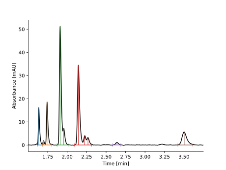
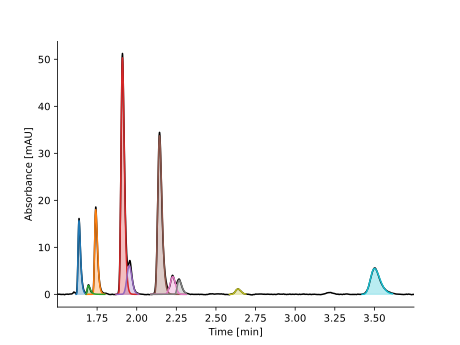

Peak Picking and Deconvolution
==============================

This example covers the peak picking and peak deconvolution capabilities of MOCCA2.

These can be called directly from the :class:`Chromatogram<mocca2.classes.chromatogram.Chromatogram>` class, or you can get more granular control using the :func:`find_peaks<mocca2.peak.find_peaks>` and :func:`deconvolve_adaptive<mocca2.deconvolve_adaptive>` functions.

First, let's import the libraries and load the data.

.. code-block:: python 
    
    from mocca2 import example_data
    from matplotlib import pyplot as plt
    import pandas as pd

    # Load the chromatogram and correct baseline
    chromatogram = example_data.example_2()
    chromatogram.correct_baseline()

    # Crop out the relevant part of the chromatogram
    chromatogram.extract_time(1.5, None, inplace=True)

Picking the peaks is a one liner. Let's see how good are the default parameters.

.. code-block:: python

    # Find the peaks
    chromatogram.find_peaks()

    # Plot chromatogram with the peaks
    chromatogram.plot()
    plt.show()

.. image:: _static/ex_peak_picking_initial.svg

The algorithm did not detect most of the smaller peaks. This can be easily fixed by adjusing the threshold.

.. code-block:: python

    # It is possible to adjust the threshold to pick even the smaller peaks
    chromatogram.find_peaks(min_height=1)

    # Let's see the chromatogram again
    chromatogram.plot()
    plt.show()

The algorithm now correctly detected all the peaks!

However, some of the peaks overlap - the algorithm merges these into a single peak with multiple maxima. To get the individual components, we need to deconvolve the peaks.

.. code-block:: python

    # As you can see, some the algorithm detected that some peaks overlap
    # Let's deconvolve them
    chromatogram.deconvolve_peaks(
        model="FraserSuzuki",
        min_r2=0.99,
        relaxe_concs=False,
        max_comps=3,
    )

    # And plot the chromatogram again
    chromatogram.plot()
    plt.show()

The algorithm was successful and separated the overlapping peaks into individual components!

Let's integrate the peaks and summarize the results.

.. code-block:: python

    # Finally, let's get all the components and calculate their area %
    # (the integral is averaged over all wavelengths)
    data = pd.DataFrame(
        [
            {
                "Elution Time": chromatogram.time[component.elution_time],
                "Integral": component.integral,
            }
            for component in chromatogram.all_components()
        ]
    )
    data["Area %"] = data["Integral"] / data["Integral"].sum() * 100
    data.sort_values("Elution Time [min]", inplace=True)
    print(data.round(2).to_string(index=False))

.. code-block::

    Elution Time [min]  Integral  Area %
                  1.64    375.87    7.51
                  1.70     54.88    1.10
                  1.74    485.64    9.71
                  1.91   1591.49   31.81
                  1.95    285.16    5.70
                  2.14   1346.80   26.92
                  2.23    187.07    3.74
                  2.27    125.47    2.51
                  2.64     56.99    1.14
                  3.50    494.14    9.88

Final note
----------
It is often rather subjective which peaks to pick, which peaks overlap, and where are the peak borders. For this reason, it might be neccessary to tweak the parameters to your needs.