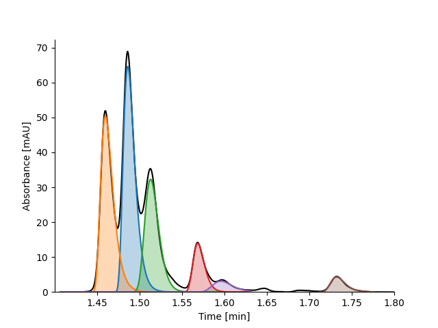

Getting Started
===============

The latest version of MOCCA2 can be installed simply using pip:

.. code-block:: bash

    pip install mocca2

Now you are ready to process your first chromatogram!

.. code-block:: python

    from mocca2 import example_data
    from matplotlib import pyplot as plt

    # Load example data
    chromatogram = example_data.example_1()

    # Correct the baseline
    chromatogram.correct_baseline()

    # Crop the chromatogram to the region of interest, 1.4 to 1.8 minutes
    chromatogram.extract_time(1.4, 1.8, inplace=True)

    # Exclude low wavelengths that tend to be noisy - ignore everything below 220 nm
    chromatogram.extract_wavelength(220, None, inplace=True)

    # Find peaks in the chromatogram
    chromatogram.find_peaks(min_height=2)

    # Deconvolve the peaks
    print("Deconvolving peaks, this migth take a minute...")

    chromatogram.deconvolve_peaks(
        model="FraserSuzuki", min_r2=0.999, relaxe_concs=False, max_comps=5
    )

    print("Deconvolved!")

    # Plot the chromatogram
    chromatogram.plot()
    plt.show()

The resulting plot shows correctly located and deconvolved peaks.

